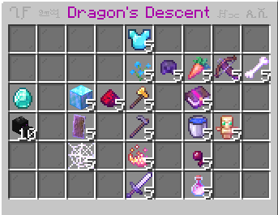

# FEATURES

WeaponMaster adds many more features other than new weapons and items. This is the official wiki for the new WeaponMaster features.

 

---

 

# WeaponMaster Dragon

WeaponMaster Dragon is a dragon that has special abilities. 

Difficulty Level: 6/5. Don't expect to beat this without custom gear.

It has 1,000 health. It will regenerate with end crystals and also naturally (as high as 1 health per 3 seconds when the dragon is low).

## Summoning

In addition to the four crystals, you must place 2 additional crystals within the 3x3 box around the fountain.

## Weight

Weight represents how much work you've done during the fight. Up to 1,375 weight can be dropped per fight, and it is used to determine loot.

| **Action**        | Weight | Maximum |
| --- | --- | --- |
| End Crystal       | 30     | 300 |
| Damage Dragon     | 1\*    | 1000 |
| Damager Bonus     | 75\*\* | 75 |

\* You get 1 weight for every 1 HP damage of the dragon, but your weight can decrease if the total damage is more (since only 1,000 weight can be given). For example, if you dealt 700 damage, but there was a total damage of 1400, you would only receive 500 weight, instead of 700.

\*\* Only one player can get the damager bonus if they have dealt at least 200 damage and are at least 30 damage above 2nd place.

## Attacks

### Hive Anger

The Dragon angers enderman to attack you.

### Call Help

Summons an End Guard that gets stronger over time. Kill it before it's too late. 

### Lightning Attack

Summons lightning on all the players around that does true damage (unavoidable damage). If you're unlucky, it can deal up to 9 hearts of damage.

### Fireball Strom

The Dragon shoots tons of dragon fireballs at the ground around.

### Toxic Strom

Effects all the players around with `Weakness I`, `Posion I`, `Hunger I`, and `Mining Fatigue I` for 10 seconds.

### Summon Ghosts

Summons Ghostly Phantoms to ruin your day.

### Summon Sniper

Summons a skilled skeleton sniper to assassin you. 

### Call Agents

Summons highly skilled and trained agents to go after you.

## Loot

### Dragon Horn

This is the strongest and rarest item. You need one of these to make powerful dragon items, like `Dragon Armor` and `Dragon Elytra`.

You need `600` weight to drop this item.

### Dragon Scale

This rare item is used to upgrade dragon items to improve their stats permanently, like `Dragon Sword` and `Dragon Elytra`.

You need `550` weight to drop this item.

### Dragon Wing

This rare item is used to craft many dragon items. You need wings to craft items like `Dragon Armor` and `Dragon Elytra`. <550 weight>

### Minor Loot

You can drop less important items as well, including shulker shells, ender pearls, and obsidian blocks.

 

---

 

# Dragon's Descent

Dragon's Descent is a late game upgrade system that upgrades your stats.

`/dragon-descent` - opens the `Dragon's Descent` gui menu.

