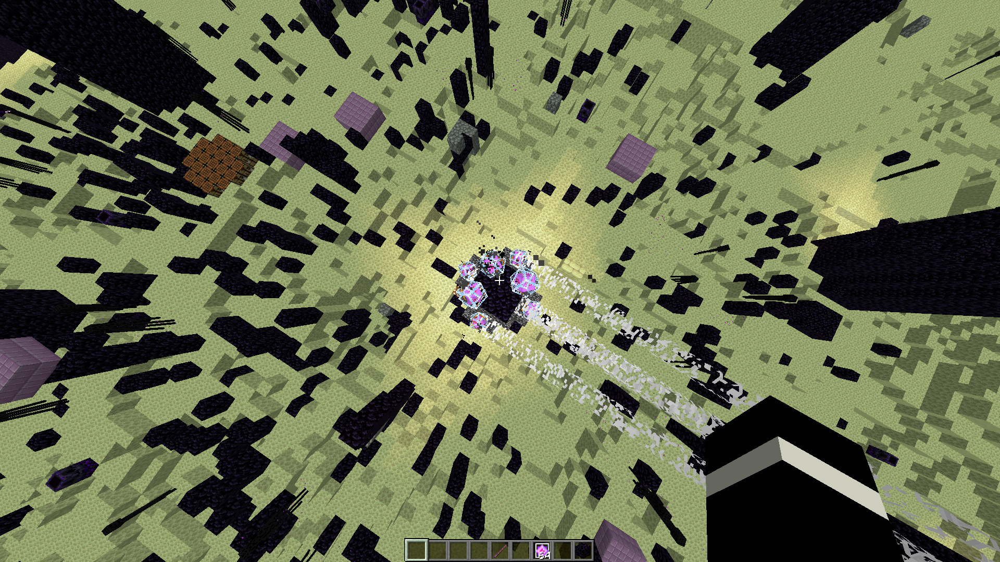
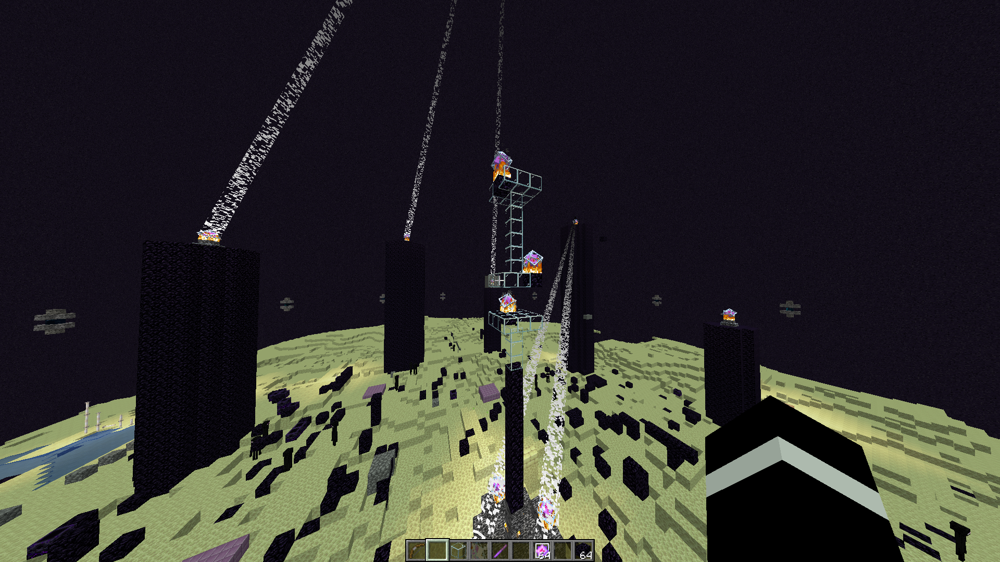
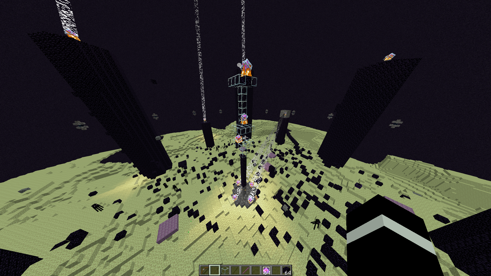

# FEATURES

WeaponMaster adds many more features other than new weapons and items. This is the official wiki for the new WeaponMaster features.

 

---

 

# WeaponMaster Dragon

WeaponMaster Dragon is a dragon that has special abilities. 

Difficulty Level: 6/5. Don't expect to beat this without custom gear.

It has 1,000 health. It regenerates health with end crystals and naturally (as high as 1 health per 3 seconds when the dragon is low).

## Summoning

In addition to the four crystals, you must place 3 additional crystals within the 3x3 box around the fountain.

For example, you could do this:

Or this:

All you need are 3 crystals that are in the 3x3 box, as shown here.

## Weight

Weight represents how much work you've done during the fight. Up to 1,375 weight can be obtained per fight, which is used to determine loot.

| **Action**    | Weight | Maximum |
|---------------|--------|---------|
| End Crystal   | 30     | 300     |
| Damage Dragon | 1\*    | 1000    |
| Damager Bonus | 75\*\* | 75      |

\* You get 1 weight for every 1 HP damage to the dragon, but your weight can decrease if the total damage is more (since only 1,000 weight can be given). For example, if you dealt 700 damage, but there was a total damage of 1400, you would only receive 500 weight, instead of 700.

\*\* Only one player can get the damager bonus if they have dealt at least 200 damage and are at least 30 damage above 2nd place.

## Attacks

### Hive Anger

The Dragon angers endermen to attack nearby players.

### Call Help

Summons an End Guard that gets stronger over time. Kill it before it's too late. 

### Lightning Attack

Summons lightning on nearby players that does true damage (unavoidable damage). If you're unlucky, it can deal up to 9 hearts of damage.

### Fireball Storm

The Dragon shoots tons of dragon fireballs at the ground around.

### Toxic Storm

Effects all the players around with `Weakness I`, `Posion I`, `Hunger I`, and `Mining Fatigue I` for 10 seconds.

### Summon Ghosts

Summons Ghostly Phantoms to ruin your day.

### Summon Sniper

Summons a skilled skeleton sniper to assassinate players. 

### Call Agents

Summons highly skilled and trained agents to go after nearby players.

## Loot

The loot that the dragon drops are player specific. It cannot be picked up by another player. These items do not despawn and cannot be blown up or burned.

### Dragon Horn

This is the strongest and rarest item. These are used make powerful dragon items, like `Dragon Armor` and `Dragon Elytra`.

At least `600` weight is required for this item to drop.

### Dragon Scale

This rare item is used to upgrade dragon items to improve their stats permanently, like `Dragon Sword` and `Dragon Elytra`.

At least `550` weight is required for this item to drop.

### Dragon Wing

This rare item is used to craft many dragon items. You need wings to craft items like `Dragon Armor` and `Dragon Elytra`.

At least `400` weight is required for this item to drop.

### Minor Loot

Some less important loot like shulker shells, ender pearls, and obsidian blocks are also drops.

 

---

 

# Dragon's Descent

Dragon's Descent is a late game upgrade system that upgrades your stats.

`/dragon-descent` - opens the `Dragon's Descent` GUI menu.

