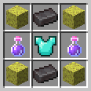
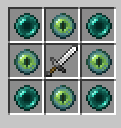
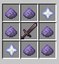
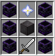
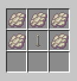

# Player's Guide

Want to add WeaponMaster to your SMP, or are playing on a server with it?
This guide will show you all the things you can do!

This guide is split into four sections: **Early Game**, **Late Game**, **Very Late Game**, and **End Game**.

# Early Game

*This is where you can mainly take advantage of **Epic** rarity items. Most are fairly easy to craft.*

### Anduril

This sword is fairly easy to make (really just 42 iron) and gives you permanent **Speed** and **Resistance**.
It's a great utility item that you can carry around even into the late game.

### Throwing Knife

An incredibly cheap craft that turns your sword into a shuriken.
You get decent ranged damage for very cheap.

### Honorable Mentions

- **Copper Sword** - a very cheap sword that can stun enemies, but it's not very powerful
- **Wither Staff** - shoots wither skulls, but might not be super useful to you

# Late Game

*This is where you can begin to take advantage of **Legendary** items.*

### The WeaponMaster Kit: Exodus, Scylla's Chestplate, Warlock Pants, Hermes Boots

These are three expensive but very powerful armor pieces.
They far outshine vanilla netherite armor.

- **Exodus** heals you when you hit enemies
- **Scylla's Chestplate** gives you damage resistance when your health is low (not as powerful as the other three)
- **Warlock Pants** give you permanent strength
- **Hermes Boots** give you a speed boost, increase your armor toughness, and allow you to dodge attacks

### End Sword

This sword requires a bit of grind.
You need 4 End Artifacts, which drop occasionally from endermites.
However, once you do get it, it lets you teleport around by right-clicking, making it amazing for movement.

### Plutonium Blade

This sword requires a lot of grind.
You need 6 pieces of plutonium, which drop occasionally from mining deepslate coal ore.
Once you do get it though, it deals very high damage, especially when critting.
And the **Implosion** ability is extremely powerful, allowing you to essentially oneshot anything within 20 blocks distance.

### Helios

When fully stocked with levels, this sword deals the single highest damage in WeaponMaster, except for Dragon Sword + Dragon Armor, which costs way more.

### Miner's Blessing

When you level it up, the pickaxe becomes very powerful.
It can switch between different modes, including fortune, silk touch, and smelting.

### Ninja Bow

This bow takes a lot of grind—you have to kill 3,000 cave spiders on average (unless your admin changes the rates).
But it shoots 3 arrows at a time instantly when left-clicking.

### Honorable Mentions

- **Artemis Bow** - Shoots heat seeking arrows, but is expensive like the Ninja Bow.
- **Dragon Sword** - A very powerful sword, but others outshine it in damage until you reach the end game.
- **Excalibur** - In an environment with totems, the 2.5 hearts of true damage might not be as overpowered as it is in UHC.
- **Shredded Axe** - Spawns zombies when you hit things. Cool, but not OP.
- **Valkyrie Axe** - It has a pretty good ability, dealing huge knockback to players affected.

# Very Late Game: Wither Challenge

*Now that you've acquired some late game items, you can start some of the special content that WeaponMaster has to offer...*

You have to defeat a Wither:

- Without armor on
- Without leaving an 80-block radius
- Solo
- Without dying
- Without cheesing

But you'll get some powerful items...

### Expert Seal

Exclusive to the Wither Challenge.
The seal upgrades all enchantments on an item by 1 level, allowing you to get **Sharpness VI** and **Protection V**.

### Wither King Staff

Exclusive to the Wither Challenge.
An upgrade of the Wither Staff.
This shoots skulls incredibly fast, and can also heal you by large amounts.

### Wither Dye

Exclusive to the Wither Challenge.
This dye can be crafted into other dyes and used to give your items a snazzy look!
Check out the list of dyes in [WEAPONS.md](https://github.com/greatericontop/weaponmaster/blob/main/WEAPONS.md) for more info.

# End Game: WeaponMaster Dragon

*Now you're powerful and can get some of the highest quality **Legendary** items in WeaponMaster.
You're also ready to tackle some of the hardest challenges.*

This dragon is no joke.
It has 1,000 health and can unleash more than 10 different attacks, each hitting you incredibly hard.
I'd recommend not attempting the dragon until you have a full protection 5 WeaponMaster kit and a good sword.

*Good luck!*

*But once you do beat it, you can get:*

### Dragon Armor

This armor is extremely powerful, with a full protection 5 set giving you:
- 35% damage reduction, or 45% with upgrades
- 8% increased damage, or 12% with upgrades
- Slower hunger depletion
- Massive buff to Dragon Sword damage
