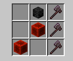
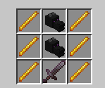
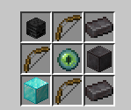
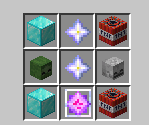
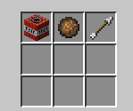
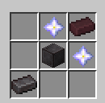
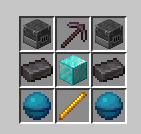
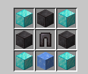
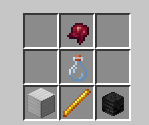
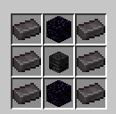

# WeaponMaster

Weaponmaster is a minecraft server plugin made using the spigot api that adds more tools and weapons to the game.

- [Installation](#installation)
- [Weapons](#weapons)
  - [RPG Launcher](#rpg-launcher)
  - [Vampire's Axe](#vampires-axe)
  - [Death's Scythe](#deaths-scythe)
  - [Dragon Sword](#dragon-sword)
  - [Artemis](#artemis-bow)
  - [Anduril](#anduril)
  - [Excalibur](#excalibur)
  - [Exodus](#exodus)
  - [Rocket Stick](#rocket-stick)
  - [Helios](#helios)
  - [Scylla's Chestplate](#scylla-chestplate)
  - [Herme's Boots](#hermesboots-boots)
  - [Helmet of Life](#helmet-of-life)
  - [Cave Man Sword](#cave-man-sword)
  - [Warlock Pants](#warlock-pants)
  - [Fireball](#fireball)
  - [Napalm Missile](#napalm-missile)
  - [Atom Bomb](#atom-bomb)
  - [Netherite Staff](#netherite-staff)
  - [Sniper Rifle](#sniper-rifle)
  - [Miner's Blessing](#miners-blessing)
- [Others](#others)
  - [Hide of Leviathan](#hide-of-leviathan)
  - [Flask of Ichor](#flask-of-inchor)
  - [Heart of Leviathan](#heart-of-leviathan)
  - [Nether Reactor Core](#nether-reactor-core)
- [Commands](#commands)
  - [Attribute Modifier](#attribute-modifier)
  - [Force Enchant](#force-enchant)
  - [Illegal Stack](#illegal-stack)
- [License](#license)

# Installation

To install the project, first download the `jar` file. 

Paste the jar file into the server `./plugins` directory

---
# Weapons

## RPG Launcher

`/rpgl give` - shoot explosive projectiles at high speed

## Vampire's Axe

`/vampaxe give` - life steals damage when you hit  

Crafting Recipe:
- 3 Netherite Axe
- 2 Redstone Block
- 1 Wither Skeleton Skill

## Death's Scythe

`/scythe give` - deal true damage and gain increasing levels of strength based on the damage dealt

## Dragon Sword

`/dragonsword give` - deals extra damage  

Crafting Recipe:
- 1 Netherite Sword
- 2 Dragon Head
- 6 Blaze Rod

## Artemis Bow

`/artemis give` - heat seeking arrows attack nearby targets  

Crafting Recipe:
- 3 Bow
- 2 Netherite Ingot
- 1 Netherite Block
- 1 Eye of Ender
- 1 Diamond Block
- 1 Wither Skeleton Skull

## Anduril

`/anduril give` - permanent speed and strength while holding (yep, this idea was stolen from hypixel)

## Excalibur

`/excalibur give` - explodes on impact and deals true damage (stolen as well)  

Crafting Recipe:
- 2 TNT
- 2 Nether Star
- 1 End Crystal
- 1 Zombie Head
- 1 Skeleton Skull
- 2 Diamond Block

## Exodus

`/exodus give` - heal whenever you hit anything (stolen x3)

## Rocket Stick

`/rocketstick give` - throw yourself or other players into the air

## Helios

`/helios give` - increases in power as you gain experience levels, right click to deal area damage

## Scylla's Chestplate

`/scylla give` - damage resistance during low health

## Herme's Boots

`/hermesboots give` - extra walk speed, gain armor toughness, and small chance to dodge attacks (basically stolen)

## Helmet of Life

`/lifehelmet give` - revives you when you're about to die, 10 minute cooldown

## Caveman Sword

`/cavemansword give` - deal more damage as you level it up by using it

## Warlock Pants

`/warlockpants give` - permanent regeneration and resistance while wearing

## Fireball

`/fireball give` - boom

Crafting Recipe: (Shapeless)
- 1 TNT
- 1 Fire Charge
- 1 Arrow

## Napalm Missile

`/napalm give` - a missle that is pretty strong.

## Atom Bomb

`/atombomb give` - absolutely mauls terrain

## Netherite Staff

`/netheritestaff` - gives random effects to the entity being hit, right click to shoot an arrow with random effects

Crafting Recipe:

- 2 Nether Star

- 1 Netherite Ingot

- 1 Netherite Block

- 1 Nether Reactor Core

## Sniper Rifle

`/sniperrifle give` - shoots fast and accurate bullets

## Miner's Blessing

`/minersblessing give` - super pickaxe, mine to level up

Note: Adding enchantments other than `Mending` will be automatically removed. Don't try to game the level system.

Crafting Recipe:
- 1 Netherite Pickaxe
- 1 Blaze Rod
- 1 Diamond Block
- 2 Netherite Ingot
- 2 Blast Furnace
- 2 Heart of the Sea

# Others

## Hide of Leviathan

Netherite Leggings with `Protection IV`, `Blast Protection IV`, `Fire Protection IV`, and `Projectile Protection IV`.

Crafting Recipe:
- 1 Netherite Leggings
- 2 Netherite Block
- 4 Diamond Block
- 1 Heart of Leviathan

## Flask of Ichor

Potion of `Instant Damage IV`

Crafting Recipe:
- 1 Fermented Spider Eye
- 1 Glass Bottle
- 1 Blaze Rod
- 1 Iron Block
- 1 Wither Skeleton Skull

## Heart of Leviathan

A piece of blue ice with 12% chance of dropping from an `Elder Guardian`. Used to craft `Hide of Leviathan`.

## Nether Reactor Core

A power core that stores the energy required for a staff. Used to craft `Netherite Staff`.
1.5% chance of dropping from a `Wither Skeleton`.

Crafting Recipe:
- 4 Blaze Rod
- 2 Obsidian
- 2 Wither Skeleton Skull
- 1 Diamond Block

---

# Commands

## Attribute Modifier

`/weaponmaster attributemodifier <attribute> <operation> <amount> <slot> [<optional uuid>]`

Modifies the item's attributes.

**Arguments**
- **attribute** Any valid value from the [bukkit `Attribute`](https://papermc.io/javadocs/paper/1.18/org/bukkit/attribute/Attribute.html) enum. These are just capitalized java style versions of the normal attribute names.
- **operation** Any valid value from the [bukkit `Operation`](https://papermc.io/javadocs/paper/1.18/org/bukkit/attribute/AttributeModifier.Operation.html) enum. Vanilla equivalents are `ADD_NUMBER = 0`, `ADD_SCALAR = 1`, `MULTIPLY_SCALAR_1 = 2`
- **amount** any valid double
- **slot** any valid value from the [bukkit `EquipmentSlot`](https://papermc.io/javadocs/paper/1.18/org/bukkit/inventory/EquipmentSlot.html) enum
- **optional uuid** any uuid (using one that is taken may result in weird behavior), or leave blank to randomly generate a new one

## Force Enchant

`/weaponmaster forceenchant <enchantment> <level>`

Forcefully echants items with enchantments. Allows you to add incompatible or ridiculously high level enchantments to an item.

**Arguments**
- **enchantment** enchantment with namespaced ID, e.g. `fire_protection`, `sharpness`
- **level** any integer or `"max" -> 255`, enchants are capped to level 255

## Illegal Stack

`/weaponmaster illegalstack <amount>`

Sets the item in hand to any amount.

**Arguments**
- **amount** Any signed byte `-128..127`, nonpositive values will delete the item. Be careful when moving illegally stacked items around.

---

# License

This project is licensed under the terms and conditions of GPL v3.
