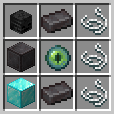
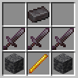
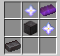
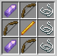
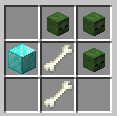
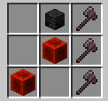

# WeaponMaster

**WeaponMaster** is a minecraft server plugin made using Spigot and Paper that adds weapons, tools, and armor items to the game.

---

- [Installation](#installation)
- [Weapons](#weapons)
  - [SUPREME](#supreme)
    - [Atom Bomb](#atom-bomb)
    - [Napalm Missile](#napalm-missile)
    - [Rocket Stick](#rocket-stick)
    - [RPG Launcher](#rpg-launcher)
    - [Sniper Rifle](#sniper-rifle)
  - [LEGENDARY](#legendary)
    - [Artemis Bow](#artemis-bow)
    - [Caveman Sword](#caveman-sword)
    - [Death's Scythe](#deaths-scythe)
    - [Dragon Sword](#dragon-sword)
    - [Excalibur](#excalibur)
    - [Exodus](#exodus)
    - [Helios](#helios)
    - [Helmet of Life](#helmet-of-life)
    - [Herme's Boots](#hermes-boots)
    - [Miner's Blessing](#miners-blessing)
    - [Netherite Staff](#netherite-staff)
    - [Ninja Bow](#ninja-bow)
    - [Pilot Sword](#pilot-sword)
    - [Poseidon's Trident](#poseidons-trident)
    - [Scylla's Chestplate](#scyllas-chestplate)
    - [Shredded Axe](#shredded-axe)
    - [Valkyrie Axe](#valkyrie-axe)
    - [Vampire's Axe](#vampires-axe)
    - [Warlock Pants](#warlock-pants)
  - [EPIC](#epic)
    - [Anduril](#anduril)
    - [Copper Sword](#copper-sword)
    - [Fireball](#fireball)
- [Others](#others)
  - [Flask of Ichor](#flask-of-ichor)
  - [Heart of Leviathan](#heart-of-leviathan)
  - [Hide of Leviathan](#hide-of-leviathan)
  - [Nether Reactor Core](#nether-reactor-core)
  - [Silky String](#silky-string)
- [Commands](#commands)
  - [Attribute Modifier](#attribute-modifier)
  - [Force Enchant](#force-enchant)
  - [Illegal Stack](#illegal-stack)
- [License](#license)

 

---

 

# Installation

To install the project, first download the `jar` file. 

Paste the jar file into the server `./plugins` directory

For better aesthetic, you can also install the [WeaponMasterOverlay](https://github.com/Gerseneck/weaponmasterresources) pack.

 

---

 

# Weapons

## SUPREME

Admin, command-only weapons of extreme power and mass destruction.

### Atom Bomb

`/atombomb give` - absolutely mauls terrain

### Napalm Missile

`/napalm give` - firey explosive device, use with caution

### Rocket Stick

`/rocketstick give` - throw yourself or other players into the air

### RPG Launcher

`/rpgl give` - shoot explosive projectiles at high speed

### Sniper Rifle

`/sniperrifle give` - shoots fast and accurate bullets

 

## LEGENDARY

Craftable weapons for late and end game players. These are very powerful.

### Artemis Bow

`/artemis give` - heat seeking arrows attack nearby targets

Crafting Recipe:
- 1x Wither Skeleton Skull
- 1x Diamond Block
- 1x Eye of Ender
- 1x Netherite Block
- 2x Netherite Ingot
- 3x Silky String

### Caveman Sword

`/cavemansword give` - deal more damage as you level it up by using it

Crafting Recipe:
- 3x Netherite Sword (you need to make a new one - it must be full durability and unenchanted)
- 2x Deepslate
- 1x Netherite Ingot
- 1x Blaze Rod

### Death's Scythe

`/scythe give` - deal true damage (30% of target's health instantly) and gain increasing levels of strength based on the damage dealt

Note: you only get 10 hits until durability runs out, and you can't use mending.

Crafting Recipe:
- 1x Clock
- 2x Netherite Ingot
- 1x Wither Skeleton Skull
- 1x Nether Star
- 2x Blaze Rod
- 2x Redstone Block

### Dragon Sword

`/dragonsword give` - deals extra damage  

Crafting Recipe:
- 6x Blaze Rod
- 2x Dragon Head
- 1x Netherite Sword

### Excalibur

`/excalibur give` - explodes on impact and deals true damage (stolen as well)

Crafting Recipe:
- 2x TNT
- 2x Nether Star
- 2x Diamond Block
- 1x End Crystal
- 1x Zombie Head
- 1x Skeleton Skull

### Exodus

`/exodus give` - heal whenever you hit anything (stolen x3)

Crafting Recipe:
- 5x Diamond Block
- 2x Golden Carrot
- 1x Enchanted Golden Apple
- 1x End Crystal

### Helios

`/helios give` - increases in power as you gain experience levels, right click to deal area damage

Crafting Recipe: 
- 6x Respawn Anchor
- 1x Nether Star
- 1x Netherite Block
- 1x Iron Sword

### Helmet of Life

`/lifehelmet give` - revives you when you're about to die, 10 minute cooldown

Crafting Recipe:
- 4x Diamond Block
- 1x Netherite Block
- 1x Totem of Undying
- 1x Lingering Regeneration Potion (extended; Regeneration I 0:22)
- 1x Lingering Healing Potion (upgraded; Instant Health II)
- 1x Life Core

### Hermes' Boots

`/hermesboots give` - extra walk speed, gain armor toughness, and small chance to dodge attacks (basically stolen)

Crafting Recipe:
- 2x Feather
- 2x Netherite Ingot
- 2x Blaze Rod
- 1x Beacon
- 1x Netherite Boots
- 1x TNT

### Miner's Blessing

`/minersblessing give` - super pickaxe, mine to level up

Note: Adding enchantments other than `Mending` will be automatically removed. Don't try to game the level system.

Crafting Recipe:
- 2x Netherite Ingot
- 2x Blast Furnace
- 2x Heart of the Sea
- 1x Netherite Pickaxe
- 1x Blaze Rod
- 1x Diamond Block

### Netherite Staff

`/netheritestaff` - gives random effects to the entity being hit, right click to shoot an arrow with random effects

Crafting Recipe:
- 2x Nether Star 
- 1x Netherite Ingot
- 1x Netherite Block 
- 1x Nether Reactor Core

### Ninja Bow

`/ninjabow give` - left click instantly fires triple shot arrows

Crafting Recipe:
- 3x Bow
- 2x Amethyst Shard
- 1x Blaze Rod
- 3x Silky String

### Pilot Sword

`/pilotsword give` - a combo sword, no attack cooldown (but less damage)

Crafting Recipe: NOT REALLY COMING SOON

### Poseidon's Trident

`/poseidontrident give` - a very powerful Trident

Crafting Recipe:
- 3x Trident
- 2x Heart of Sea
- 2x Blaze Rod

### Scylla's Chestplate

`/scylla give` - damage resistance during low health

Crafting Recipe:
- 1x Diamond Chestplate
- 4x Sponge
- 2x Netherite Ingot
- 2x Potion of the Turtle Master (upgraded; Slowness VI and Resistance IV)

### Shredded Axe

`/shreddedaxe give` - Summons a zombie when hitting an enemy.

Crafting Recipe:
- 1x Diamond Block
- 2x Bone
- 3x Zombie Head

### Valkyrie Axe

`/valkyrie give` - heavy axe gives high damage and low swing speed, but can deal massive knockback

Crafting Recipe:
- 4x Iron Block
- 1x Netherite Ingot
- 2x Stick

### Vampire's Axe

`/vampaxe give` - life steals damage when you hit

Crafting Recipe:
- 3x Netherite Axe
- 2x Redstone Block
- 1x Wither Skeleton Skull

### Warlock Pants

`/warlockpants give` - permanent strength while wearing

Crafting Recipe: 
- 2x Netherite Ingot
- 1x Wither Skeleton Skull
- 2x Blaze Rod
- 1x Netherite Leggings
- 1x Magma Cream
- 1x Diamond Sword (you need to make a new one - it must be full durability and unenchanted)
- 1x End Crystal

 

## EPIC

Early to mid-game weapons

### Anduril

`/anduril give` - permanent speed and strength while holding (yep, this idea was stolen from hypixel)

Crafting Recipe:
- 6x Feather
- 1x Anvil
- 1x Iron Block
- 1x Iron Sword

### Copper Sword

`/coppersword give` - has a chance of stunning the enemy up to 4 seconds. It gets weaker and weaker over time. Use honeycomb in an anvil to wax it and prevent it from oxidizing.

Crafting Recipe:
- 8x Copper Block
- 1x Iron Sword

### Fireball

`/fireball give` - boom

Crafting Recipe:  
(Shapeless)
- 1x TNT
- 1x Fire Charge
- 1x Arrow

 

---

 

# Others

`/minoritem list` - a list of commands for minor items.m

### Flask of Ichor

Potion of `Instant Damage IV`

Crafting Recipe:
- 1x Fermented Spider Eye
- 1x Glass Bottle
- 1x Blaze Rod
- 1x Iron Block
- 1x Wither Skeleton Skull

### Heart of Leviathan

A piece of blue ice with 12% chance of dropping from an `Elder Guardian`. Used to craft `Hide of Leviathan`.

### Hide of Leviathan

Netherite Leggings with `Protection IV`, `Blast Protection IV`, `Fire Protection IV`, and `Projectile Protection IV`.

Crafting Recipe:
- 4x Diamond Block
- 2x Netherite Block
- 1x Netherite Leggings
- 1x Heart of Leviathan

### Nether Reactor Core

A power core that stores the energy required for a staff. Used to craft `Netherite Staff`.
1.5% chance of dropping from a `Wither Skeleton`.

Crafting Recipe:
- 4x Blaze Rod
- 2x Obsidian
- 2x Wither Skeleton Skull
- 1x Diamond Block

### Silky String

A magical string used to craft `Artemis Bow` and `Ninja Bow`.
0.1% chance of dropping from a `Cave Spider``.

 

---

 

# Commands

## Attribute Modifier

`/weaponmaster attributemodifier <attribute> <operation> <amount> <slot> [<optional uuid>]`

Modifies the item's attributes.

**Arguments**
- **attribute** ≫ Any valid value from the [`Attribute`](https://papermc.io/javadocs/paper/1.18/org/bukkit/attribute/Attribute.html) enum. These are just capitalized java style versions of the normal attribute names.
- **operation** ≫ Any valid value from the [`Operation`](https://papermc.io/javadocs/paper/1.18/org/bukkit/attribute/AttributeModifier.Operation.html) enum. Vanilla equivalents are `ADD_NUMBER = 0`, `ADD_SCALAR = 1`, `MULTIPLY_SCALAR_1 = 2`
- **amount** ≫ any valid double
- **slot** ≫ any valid value from the [`EquipmentSlot`](https://papermc.io/javadocs/paper/1.18/org/bukkit/inventory/EquipmentSlot.html) enum
- **optional uuid** ≫ any uuid (using one that is taken may result in weird behavior), or leave blank to randomly generate a new one

## Force Enchant

`/weaponmaster forceenchant <enchantment> <level>`

Forcefully echants items with enchantments. Allows you to add incompatible or ridiculously high level enchantments to an item.

**Arguments**
- **enchantment** ≫ enchantment with namespaced ID, e.g. `fire_protection`, `sharpness`
- **level** ≫ any integer or `"max" -> 255`, enchants are capped to level 255

## Illegal Stack

`/weaponmaster illegalstack <amount>`

Sets the item in hand to any amount.

**Arguments**
- **amount** ≫ Any signed byte `-128..127`, nonpositive values will delete the item.

Note: Be careful when moving illegally stacked items around. For now, using the hotkey to move them between the offhand and shift clicking will preserve stacks of up to 64 (items stacked to 127 can only be moved to the offhand). Also don't put too many illegally stacked items into shulker boxes, since I banned myself once because of that. Stacking shulker boxes should be ok.

 

---

 

# License

This project is licensed under the terms and conditions of GPL v3.
