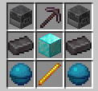

# WeaponMaster

a weapons plugin

# Weapons

## RPG Launcher

`/rpgl give` - shoot explosive projectiles at high speed

## Vampire's Axe

`/vampaxe give` - life steals damage when you hit  

Crafting Recipe:
- 3 Netherite Axe
- 2 Redstone Block
- 1 Wither Skeleton Skill

## Death's Scythe

`/scythe give` - deal true damage and gain increasing levels of strength based on the damage dealt

## Dragon Sword

`/dragonsword give` - deals extra damage  

Crafting Recipe:
- 1 Netherite Sword
- 2 Dragon Head
- 6 Blaze Rod

## Artemis Bow

`/artemis give` - heat seeking arrows attack nearby targets  

Crafting Recipe:
- 3 Bow
- 2 Netherite Ingot
- 1 Netherite Block
- 1 Eye of Ender
- 1 Diamond Block
- 1 Wither Skeleton Skull

## Anduril

`/anduril give` - permanent speed and strength while holding (yep, this idea was stolen from hypixel)

## Excalibur

`/excalibur give` - explodes on impact and deals true damage (stolen as well)  

Crafting Recipe:
- 2 TNT
- 2 Nether Star
- 1 End Crystal
- 1 Zombie Head
- 1 Skeleton Skull
- 2 Diamond Block

## Exodus

`/exodus give` - heal whenever you hit anything (stolen x3)

## Rocket Stick

`/rocketstick give` - throw yourself or other players into the air

## Helios

`/helios give` - increases in power as you gain experience levels, right click to deal area damage

## Scylla's Chestplate

`/scylla give` - damage resistance during low health

## Herme's Boots

`/hermesboots give` - extra walk speed, gain armor toughness, and small chance to dodge attacks (basically stolen)

## Helmet of Life

`/lifehelmet give` - revives you when you're about to die, 10 minute cooldown

## Caveman Sword

`/cavemansword give` - deal more damage as you level it up by using it

## Warlock Pants

`/warlockpants give` - permanent regeneration and resistance while wearing

## Fireball

`/fireball give` - boom

Crafting Recipe: (Shapeless)
- 1 TNT
- 1 Fire Charge
- 1 Arrow

## Atom Bomb

`/atombomb give` - absolutely mauls terrain

## Netherite Staff

`/netheritestaff` - gives random effects to the entity being attacked

## Sniper Rifle

`/sniperrifle give` - shoots fast and accurate bullets

## Miner's Blessing

`/minersblessing give` - super pickaxe, mine to level up

Crafting Recipe:
- 1 Netherite Pickaxe
- 2 Netherite Ingot
- 2 Blaze Rod
- 2 Blast Furnace

# Others

## Hide of Leviathan

Netherite Leggings with `Protection IV`, `Blast Protection IV`, `Fire Protection IV`, and `Projectile Protection IV`.

Crafting Recipe:
- 1 Netherite Leggings
- 2 Netherite Block
- 4 Diamond Block
- 1 Heart of Leviathan

## Flask of Ichor

Potion of `Instant Damage IV`

Crafting Recipe:
- 1 Fermented Spider Eye
- 1 Glass Bottle
- 1 Blaze Rod
- 1 Iron Block
- 1 Wither Skeleton Skull

## Heart of Leviathan

A piece of blue ice with 12% chance of dropping from an `Elder Guardian`. Used to craft `Hide of Leviathan`.

---

# Usage

build using maven

license under GPL v3
