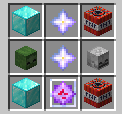
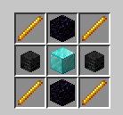

# WeaponMaster

**WeaponMaster** is a minecraft server plugin made using Spigot and Paper that adds weapons, tools, and armor items to the game.

---

- [Installation](#installation)
- [Weapons](#weapons)
  - [SUPREME](#supreme)
    - [Atom Bomb](#atom-bomb)
    - [Death's Scythe](#deaths-scythe)
    - [Exodus](#exodus)
    - [Helios](#helios)
    - [Helmet of Life](#helmet-of-life)
    - [Herme's Boots](#hermes-boots)
    - [Napalm Missile](#napalm-missile)
    - [Pilot Sword](#pilot-sword)
    - [Rocket Stick](#rocket-stick)
    - [RPG Launcher](#rpg-launcher)
    - [Scylla's Chestplate](#scyllas-chestplate)
    - [Shredded Axe](#shredded-axe)
    - [Sniper Rifle](#sniper-rifle)
    - [Warlock Pants](#warlock-pants)
  - [LEGENDARY](#legendary)
    - [Artemis Bow](#artemis-bow)
    - [Caveman Sword](#caveman-sword)
    - [Dragon Sword](#dragon-sword)
    - [Excalibur](#excalibur)
    - [Miner's Blessing](#miners-blessing)
    - [Netherite Staff](#netherite-staff)
    - [Ninja Bow](#ninja-bow)
    - [Poseidon's Trident](#poseidons-trident)
    - [Valkyrie Axe](#valkyrie-axe)
    - [Vampire's Axe](#vampires-axe)
  - [EPIC](#epic)
    - [Anduril](#anduril)
    - [Copper Sword](#copper-sword)
    - [Fireball](#fireball)
- [Others](#others)
  - [Hide of Leviathan](#hide-of-leviathan)
  - [Flask of Ichor](#flask-of-inchor)
  - [Heart of Leviathan](#heart-of-leviathan)
  - [Nether Reactor Core](#nether-reactor-core)
- [Commands](#commands)
  - [Attribute Modifier](#attribute-modifier)
  - [Force Enchant](#force-enchant)
  - [Illegal Stack](#illegal-stack)
- [License](#license)

---

# Installation

To install the project, first download the `jar` file. 

Paste the jar file into the server `./plugins` directory

For better aesthetic, you can also install the [WeaponMasterOverlay](https://github.com/Gerseneck/weaponmasterresources) pack.

---

# Weapons

A long list of Weapons that are in this plugin. 

# SUPREME

Uncraftable (command-only) weapons of extreme power and mass destruction.

## Atom Bomb

`/atombomb give` - absolutely mauls terrain

## Death's Scythe

`/scythe give` - deal true damage and gain increasing levels of strength based on the damage dealt

## Exodus

`/exodus give` - heal whenever you hit anything (stolen x3)

## Helios

`/helios give` - increases in power as you gain experience levels, right click to deal area damage

## Helmet of Life

`/lifehelmet give` - revives you when you're about to die, 10 minute cooldown

## Herme's Boots

`/hermesboots give` - extra walk speed, gain armor toughness, and small chance to dodge attacks (basically stolen)

## Napalm Missile

`/napalm give` - firey explosive device, use with caution

## Pilot Sword

`/pilotsword give` - a combo sword, no attack cooldown.

## Rocket Stick

`/rocketstick give` - throw yourself or other players into the air

## RPG Launcher

`/rpgl give` - shoot explosive projectiles at high speed

## Scylla's Chestplate

`/scylla give` - damage resistance during low health

## Shredded Axe

`/shreddedaxe give` - Summons a zombie when hitting an enemy.

## Sniper Rifle

`/sniperrifle give` - shoots fast and accurate bullets

## Warlock Pants

`/warlockpants give` - permanent regeneration and resistance while wearing

---

# LEGENDARY

Craftable weapons for late and end game players. These are very powerful.

## Artemis Bow

`/artemis give` - heat seeking arrows attack nearby targets

Crafting Recipe:
- 3 Bow
- 2 Netherite Ingot
- 1 Netherite Block
- 1 Eye of Ender
- 1 Diamond Block
- 1 Wither Skeleton Skull

## Caveman Sword

`/cavemansword give` - deal more damage as you level it up by using it

## Dragon Sword

`/dragonsword give` - deals extra damage  

Crafting Recipe:
- 1 Netherite Sword
- 2 Dragon Head
- 6 Blaze Rod

## Excalibur

`/excalibur give` - explodes on impact and deals true damage (stolen as well)

Crafting Recipe:
- 2 TNT
- 2 Nether Star
- 1 End Crystal
- 1 Zombie Head
- 1 Skeleton Skull
- 2 Diamond Block

## Miner's Blessing

`/minersblessing give` - super pickaxe, mine to level up

Note: Adding enchantments other than `Mending` will be automatically removed. Don't try to game the level system.

Crafting Recipe:
- 1 Netherite Pickaxe
- 1 Blaze Rod
- 1 Diamond Block
- 2 Netherite Ingot
- 2 Blast Furnace
- 2 Heart of the Sea

## Netherite Staff

`/netheritestaff` - gives random effects to the entity being hit, right click to shoot an arrow with random effects

Crafting Recipe:
- 2 Nether Star 
- 1 Netherite Ingot
- 1 Netherite Block 
- 1 Nether Reactor Core

## Ninja Bow

`/ninjabow give` - left click instantly fires triple shot arrows

Crafting Recipe:

## Poseidon's Trident

`/poseidontrident give` - a very powerful Trident

Crafting Recipe:
- 3 Trident
- 2 Heart of Sea
- 2 Blaze Rod

## Valkyrie Axe

`/valkyrie give` - sample description

Crafting Recipe:
- 4 Iron Block
- 1 Netherite Ingot
- 2 Stick

## Vampire's Axe

`/vampaxe give` - life steals damage when you hit

Crafting Recipe:
- 3 Netherite Axe
- 2 Redstone Block
- 1 Wither Skeleton Skull

---

# Epic

Early to mid-game weapons

## Anduril

`/anduril give` - permanent speed and strength while holding (yep, this idea was stolen from hypixel)

Crafting Recipe:
- 6 Feather
- 1 Anvil
- 1 Iron Block
- 1 Iron Sword

## Copper Sword

`/coppersword give` - has a chance of stunning the enemy up to 4 seconds. It gets weaker and weaker over time. Use honeycomb in an anvil to wax it and prevent it from oxidizing.

Crafting Recipe:
- 8 Copper Block
- 1 Iron Sword

## Fireball

`/fireball give` - boom

Crafting Recipe: (Shapeless)
- 1 TNT
- 1 Fire Charge
- 1 Arrow

---

# Others

## Hide of Leviathan

Netherite Leggings with `Protection IV`, `Blast Protection IV`, `Fire Protection IV`, and `Projectile Protection IV`.

Crafting Recipe:
- 1 Netherite Leggings
- 2 Netherite Block
- 4 Diamond Block
- 1 Heart of Leviathan

## Flask of Ichor

Potion of `Instant Damage IV`

Crafting Recipe:
- 1 Fermented Spider Eye
- 1 Glass Bottle
- 1 Blaze Rod
- 1 Iron Block
- 1 Wither Skeleton Skull

## Heart of Leviathan

A piece of blue ice with 12% chance of dropping from an `Elder Guardian`. Used to craft `Hide of Leviathan`.

## Nether Reactor Core

A power core that stores the energy required for a staff. Used to craft `Netherite Staff`.
1.5% chance of dropping from a `Wither Skeleton`.

Crafting Recipe:
- 4 Blaze Rod
- 2 Obsidian
- 2 Wither Skeleton Skull
- 1 Diamond Block

---

# Commands

## Attribute Modifier

`/weaponmaster attributemodifier <attribute> <operation> <amount> <slot> [<optional uuid>]`

Modifies the item's attributes.

**Arguments**
- **attribute** ≫ Any valid value from the [bukkit `Attribute`](https://papermc.io/javadocs/paper/1.18/org/bukkit/attribute/Attribute.html) enum. These are just capitalized java style versions of the normal attribute names.
- **operation** ≫ Any valid value from the [bukkit `Operation`](https://papermc.io/javadocs/paper/1.18/org/bukkit/attribute/AttributeModifier.Operation.html) enum. Vanilla equivalents are `ADD_NUMBER = 0`, `ADD_SCALAR = 1`, `MULTIPLY_SCALAR_1 = 2`
- **amount** ≫ any valid double
- **slot** ≫ any valid value from the [bukkit `EquipmentSlot`](https://papermc.io/javadocs/paper/1.18/org/bukkit/inventory/EquipmentSlot.html) enum
- **optional uuid** ≫ any uuid (using one that is taken may result in weird behavior), or leave blank to randomly generate a new one

## Force Enchant

`/weaponmaster forceenchant <enchantment> <level>`

Forcefully echants items with enchantments. Allows you to add incompatible or ridiculously high level enchantments to an item.

**Arguments**
- **enchantment** ≫ enchantment with namespaced ID, e.g. `fire_protection`, `sharpness`
- **level** ≫ any integer or `"max" -> 255`, enchants are capped to level 255

## Illegal Stack

`/weaponmaster illegalstack <amount>`

Sets the item in hand to any amount.

**Arguments**
- **amount** ≫ Any signed byte `-128..127`, nonpositive values will delete the item.

Note: Be careful when moving illegally stacked items around. For now, using the hotkey to move them between the offhand and shift clicking will preserve stacks of up to 64 (items stacked to 127 can only be moved to the offhand). Also don't put too many illegally stacked items into shulker boxes, since I banned myself once because of that. Stacking shulker boxes should be ok.

---

# License

This project is licensed under the terms and conditions of GPL v3.
