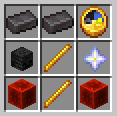
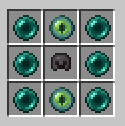
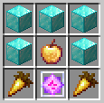
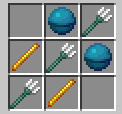
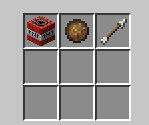
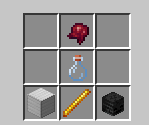

# ITEMS

- [SUPREME](#supreme)
  - [Atom Bomb](#atom-bomb)
  - [Death Rod](#death-rod)
  - [Napalm Missile](#napalm-missile)
  - [Ninja Master's Bow](#ninja-masters-bow)
  - [Rocket Stick](#rocket-stick)
  - [RPG Launcher](#rpg-launcher)
  - [Sniper Rifle](#sniper-rifle)
- [LEGENDARY](#legendary)
  - [Agricultural Abomination](#agricultural-abomination)
  - [Ares](#ares)
  - [Artemis Bow](#artemis-bow)
  - [Caveman Sword](#caveman-sword)
  - [Death's Scythe](#deaths-scythe)
  - [Dragon Armor](#dragon-armor)
  - [Dragon Elytra](#dragon-elytra)
  - [Dragon Sword](#dragon-sword)
  - [End Armor](#end-armor)
  - [End Sword](#end-sword)
  - [Excalibur](#excalibur)
  - [Exodus](#exodus)
  - [Helios](#helios)
  - [Helmet of Life](#helmet-of-life)
  - [Herme's Boots](#hermes-boots)
  - [Miner's Blessing](#miners-blessing)
  - [Netherite Staff](#netherite-staff)
  - [Ninja Bow](#ninja-bow)
  - [Pilot Sword](#pilot-sword)
  - [Plutonium Blade](#plutonium-blade)
  - [Poseidon's Trident](#poseidons-trident)
  - [Scylla's Chestplate](#scyllas-chestplate)
  - [Shredded Axe](#shredded-axe)
  - [Valkyrie Axe](#valkyrie-axe)
  - [Vampire's Axe](#vampires-axe)
  - [Warlock Pants](#warlock-pants)
  - [Witch Sword](#witch-sword)
  - [Wither King Staff](#wither-king-staff)
- [EPIC](#epic)
  - [Anduril](#anduril)
  - [Copper Sword](#copper-sword)
  - [Fireball](#fireball)
  - [Scorpion Bow](#scorpion-bow)
  - [Throwing Knife](#throwing-knife)
  - [Wither Staff](#wither-staff)
- [Others](#others)
  - [Crude Plutonium](#crude-plutonium)
  - [Diamond Apex](#diamond-apex)
  - [Emerald Apex](#emerald-apex)
  - [Expert Seal](#expert-seal)
  - [Flask of Ichor](#flask-of-ichor)
  - [Heart of Leviathan](#heart-of-leviathan)
  - [Hide of Leviathan](#hide-of-leviathan)
  - [Magic Energy Bar](#magic-energy-bar)
  - [Nether Reactor Core](#nether-reactor-core)
  - [Redstone Apex](#redstone-apex)
  - [Silky String](#silky-string)
  - [Super XP Bottle](#super-xp-bottle)
  - [Weapons Grade Plutonium](#weapons-grade-plutonium)
  - [Wither Head](#wither-head)
- [Dyes](#dyes)
  - [Basic Dyes](#basic-dyes)
  - [Special Dyes](#special-dyes)

 

---

 

## SUPREME

Admin, command-only weapons of extreme power and mass destruction.

### Atom Bomb

`/atombomb give` - absolutely mauls terrain

### Death Rod

`/deathrod give` - instantly kills whatever it hits, even through totems

### Napalm Missile

`/napalm give` - firey explosive device, use with caution

### Ninja Master's Bow

`/ninjamastersbow give` - shoots 25 arrows at a time with no cooldown

### Rocket Stick

`/rocketstick give` - throw yourself or other players into the air

### RPG Launcher

`/rpgl give` - shoot explosive projectiles at high speed

### Sniper Rifle

`/sniperrifle give` - shoots fast and accurate bullets

 

## LEGENDARY

Craftable weapons for late and end game players. These are very powerful.

### Agricultural Abomination

`/agriculturalabomination give` - automatically replants crops that are harvested

Crafting Recipe: NOT REALLY COMING SOON

### Ares

`/ares give` - lightning strikes for 1 heart of true damage

Crafting Recipe: NOT REALLY COMING SOON

### Artemis Bow

`/artemis give` - heat seeking arrows attack nearby targets

Crafting Recipe:
- 1x Wither Skeleton Skull
- 1x Diamond Block
- 1x Eye of Ender
- 1x Netherite Block
- 2x Netherite Ingot
- 3x Silky String

### Caveman Sword

`/cavemansword give` - deal more damage as you level it up by using it

Crafting Recipe:
- 3x Netherite Sword (you need to make a new one - it must be full durability and unenchanted)
- 2x Deepslate
- 1x Netherite Ingot
- 1x Blaze Rod

### Death's Scythe

`/scythe give` - deal true damage (30% of target's health instantly) and gain increasing levels of strength based on the damage dealt

Note: you only get 10 hits until durability runs out, and you can't use mending.

Crafting Recipe:
- 2x Blaze Rod
- 2x Redstone Block
- 2x Netherite Ingot
- 1x Clock
- 1x Wither Skeleton Skull
- 1x Nether Star

### Dragon Armor

`/dragonarmor give` - super powerful set of armor

for each piece of armor you get: 
- damage reduction by 5% (20% max)
- increases damage dealt by 3.5% (14% max)

full set bonus:
- increases damage dealt by `Dragon Sword` by 25%
- hunger decreases 33% slower
- damage reduction by 0.75% per protection level

#### Helmet

Crafting Recipe:
- 5x Dragon Wing
- 1x Dragon Horn

#### Chestplate

Crafting Recipe:
- 8x Dragon Wing
- 1x Dragon Horn

#### Leggings

Crafting Recipe:
- 7x Dragon Wing
- 1x Dragon Horn

#### Boots

Crafting Recipe:
- 4x Dragon Wing
- 1x Dragon Horn

### Dragon Elytra

`/dragonelytra give` - a powerful elytra, small speed boost when in flying, use `Eye of Ender` to gain a massive speed boost.

Crafting Recipe:
- 4x Dragon Wing
- 1x Elytra

### Dragon Sword

`/dragonsword give` - deals extra damage

Crafting Recipe:
- 6x Blaze Rod
- 2x Dragon Head
- 1x Netherite Sword

### End Armor

`/endarmor give` - increases the power of the End Sword

Crafting Recipe:
- 6x Ender Pearl
- 2x End Artifact
- 1x any netherite armor

### End Sword

`/endsword give` - right click to teleport forward

Crafting Recipe:
- 4x Ender Pearl
- 4x End Artifact
- 1x Iron Sword

### Excalibur

`/excalibur give` - explodes on impact and deals true damage (stolen as well)

Crafting Recipe:
- 2x TNT
- 2x Nether Star
- 2x Diamond Block
- 1x End Crystal
- 1x Zombie Head
- 1x Skeleton Skull

### Exodus

`/exodus give` - heal whenever you hit anything (stolen x3)

Crafting Recipe:
- 5x Diamond Block
- 2x Golden Carrot
- 1x Enchanted Golden Apple
- 1x End Crystal

### Helios

`/helios give` - increases in power as you gain experience levels, right click to deal area damage

Crafting Recipe:
- 6x Respawn Anchor
- 1x Nether Star
- 1x Netherite Block
- 1x Iron Sword

### Helmet of Life

`/lifehelmet give` - revives you when you're about to die, 10 minute cooldown

Crafting Recipe:
- 4x Diamond Block
- 1x Netherite Block
- 1x Totem of Undying
- 1x Lingering Regeneration Potion (extended; Regeneration I 0:22)
- 1x Lingering Healing Potion (upgraded; Instant Health II)
- 1x Life Core

### Hermes' Boots

`/hermesboots give` - extra walk speed, gain armor toughness, and small chance to dodge attacks (basically stolen)

Crafting Recipe:
- 2x Feather
- 2x Netherite Ingot
- 2x Blaze Rod
- 1x Beacon
- 1x Netherite Boots
- 1x TNT

### Miner's Blessing

`/minersblessing give` - super pickaxe, mine to level up

Note: Adding enchantments other than `Mending` will be automatically removed. Don't try to game the level system.

Crafting Recipe:
- 2x Netherite Ingot
- 2x Blast Furnace
- 2x Heart of the Sea
- 1x Netherite Pickaxe
- 1x Blaze Rod
- 1x Diamond Block

### Netherite Staff

`/netheritestaff` - gives random effects to the entity being hit, right click to shoot an arrow with random effects

Crafting Recipe:
- 2x Nether Star
- 1x Netherite Ingot
- 1x Netherite Block
- 1x Nether Reactor Core

### Ninja Bow

`/ninjabow give` - left click instantly fires triple shot arrows

Crafting Recipe:
- 3x Bow
- 2x Amethyst Shard
- 1x Blaze Rod
- 3x Silky String

### Pilot Sword

`/pilotsword give` - a combo sword, no attack cooldown (but less damage)

Crafting Recipe: NOT REALLY COMING SOON

### Plutonium Blade

`/plutoniumblade give` - crits deal extra damage, and implosion ability to deal massive damage to nearby targets

Crafting Recipe:
- 1x Netherite Sword
- 2x Nether Star
- 6x Weapons Grade Plutonium

### Poseidon's Trident

`/poseidontrident give` - a very powerful Trident

Crafting Recipe:
- 3x Trident
- 2x Heart of Sea
- 2x Blaze Rod

### Scylla's Chestplate

`/scylla give` - damage resistance during low health

Crafting Recipe:
- 1x Diamond Chestplate
- 4x Sponge
- 2x Netherite Ingot
- 2x Potion of the Turtle Master (upgraded; Slowness VI and Resistance IV)

### Shredded Axe

`/shreddedaxe give` - Summons a zombie when hitting an enemy.

Crafting Recipe:
- 1x Diamond Block
- 2x Bone
- 3x Zombie Head

### Valkyrie Axe

`/valkyrie give` - heavy axe gives high damage and low swing speed, but can deal massive knockback

Crafting Recipe:
- 4x Iron Block
- 1x Netherite Ingot
- 2x Stick

### Vampire's Axe

`/vampaxe give` - life steals damage when you hit

Crafting Recipe:
- 3x Netherite Axe
- 2x Redstone Block
- 1x Wither Skeleton Skull

### Warlock Pants

`/warlockpants give` - permanent strength while wearing

Crafting Recipe:
- 2x Netherite Ingot
- 1x Wither Skeleton Skull
- 2x Blaze Rod
- 1x Netherite Leggings
- 1x Magma Cream
- 1x Diamond Sword (you need to make a new one - it must be full durability and unenchanted)
- 1x End Crystal

### Witch Sword

`/witchsword give` - targets hit are cursed and heal their attackers

Crafting Recipe: NOT REALLY COMING SOON

### Wither King Staff

`/witherkingstaff give` - upgraded Wither Staff

Skulls shoot faster and travel faster, and adds `Wither Shield` ability for healing.

Crafting Recipe:
- 1x Blaze Rod
- 1x Wither Staff
- 3x Wither Head

 

## EPIC

Early to mid-game weapons

### Anduril

`/anduril give` - permanent speed and strength while holding (yep, this idea was stolen from hypixel)

Crafting Recipe:
- 6x Feather
- 1x Anvil
- 1x Iron Block
- 1x Iron Sword

### Copper Sword

`/coppersword give` - has a chance of stunning the enemy up to 4 seconds. It gets weaker and weaker over time. Use honeycomb in an anvil to wax it and prevent it from oxidizing.

Crafting Recipe:
- 8x Copper Block
- 1x Iron Sword

### Fireball

`/fireball give` - boom

Crafting Recipe:  
(Shapeless)
- 1x TNT
- 1x Fire Charge
- 1x Arrow

### Scorpion Bow

`/scorpionbow give` - shoots arrows that poison targets

Crafting Recipe: NOT REALLY COMING SOON

### Throwing Knife

`/throwingknife give` - A throwable knife that deals 2 hearts of damage.

Crafting Recipe:
- 1x Iron Block
- 1x Iron Sword
- 1x Piston

### Wither Staff

`/witherstaff give` - shoots wither skeleton skulls.

Crafting Recipe:
- 2x Blaze Rod
- 1x Wither Skeleton Skull
- 1x Fire Charge
- 1x TNT

 

---

 

# Others

`/minoritem list` - a list of commands for minor items.

### Crude Plutonium

Deepslate coal ore can sometimes contain radioactive materials. It has a 9% chance to drop from breaking deepslate coal ore.

### Diamond Apex

The best diamond ever. Drops `3.5%` of the time from diamond ores and is used to craft dyes.

### Emerald Apex

The best emerald ever. Drops `12%` of the time from emerald ores and is used to craft dyes.

### Expert Seal

2.5% chance of dropping for a `Wither`, or complete the **Wither Challenge** (see [`FEATURES.md`](https://github.com/greatericontop/weaponmaster/blob/main/FEATURES.md)).

Increases all the enchantments on an item by 1 level. Can only be used once per item.

### Flask of Ichor

Potion of `Instant Damage IV`

Crafting Recipe:
- 1x Fermented Spider Eye
- 1x Glass Bottle
- 1x Blaze Rod
- 1x Iron Block
- 1x Wither Skeleton Skull

### Heart of Leviathan

A piece of blue ice with 12% chance of dropping from an `Elder Guardian`. Used to craft `Hide of Leviathan`.

### Hide of Leviathan

Netherite Leggings with `Protection IV`, `Blast Protection IV`, `Fire Protection IV`, and `Projectile Protection IV`.

Crafting Recipe:
- 4x Diamond Block
- 2x Netherite Block
- 1x Netherite Leggings
- 1x Heart of Leviathan

### Life Core

0.8% chance of dropping from an `Evoker`. Used to craft `Helmet of Life`.

### Magic Energy Bar

A bar of magical energy. Increase an additional heart when consumed. Able to accumulate up to 6 hearts, 2 are lost when you die. 

### Nether Reactor Core

A power core that stores the energy required for a staff. Used to craft `Netherite Staff`.
2% chance of dropping from a `Piglin Brute`.

Crafting Recipe:
- 4x Blaze Rod
- 2x Obsidian
- 2x Wither Skeleton Skull
- 1x Diamond Block

### Redstone Apex

The best redstone ever. Drops `0.75%` of the time from redstone ores and is used to craft dyes.

### Silky String

A magical string used to craft `Artemis Bow` and `Ninja Bow`.
0.1% chance of dropping from a `Cave Spider`.

### Super XP Bottle

A supercharged bottle of experience, granting over 25 levels when used.

There is currently no crafting recipe.

### Weapons Grade Plutonium

Used to craft a plutonium blade. Can be crafted from crude plutonium.

Crafting Recipe:
- 8x Piston
- 1x Crude Plutonium

### Wither Head

Drops from killing withers without armor. Used to upgrade a `Wither Staff` into a `Wither King Staff`.

 

---

 

# Dyes

You can obtain a `Wither Dye` from killing a wither without armor.
This dye applies a dark gray color to the name of an item when you move it on top of that item.

The `Wither Dye` can also be crafted into other dyes.

## Basic Dyes

(You can also get the dyes with `/minoritem`)

| Dye Name         | Color     | Crafting Recipe                              |
|------------------|-----------|----------------------------------------------|
| Wither Dye       | Dark Gray | Dropped from withers                         |
| Diamond Dye      | Aqua      | Wither Dye, Diamond Apex, 7 Diamond Block    |
| Emerald Dye      | Green     | Wither Dye, Emerald Apex, 7 Emerald Block    |
| Crystal Dye      | Pink      | Wither Dye, 8 Amethyst Cluster               |
| Lapis Dye        | Blue      | Wither Dye, 8 Lapis Block                    |
| Dark Diamond Dye | Dark Aqua | Diamond Dye, 6 Diamond Apex                  |
| Gold Dye         | Gold      | Wither Dye, 4 Enchanted Golden Apple         |
| Redstone Dye     | Red       | Wither Dye, Redstone Apex, 7 Redstone Block  |
| Blood Dye        | Dark Red  | Redstone Dye, 4 Redstone Apex, 4 Zombie Head |

## Special Dyes

| Dye Name      | Color            | Crafting Recipe                              |
|---------------|------------------|----------------------------------------------|
| Leviathan Dye | Blue & Dark Aqua | Wither Dye, Heart of Leviathan, 7 Wet Sponge |
| Expert Dye    | Orange & Yellow  | Wither Dye, 4 Expert Seal                    |
| Dragon Dye    | Purple & Pink    | Wither Dye, 3 Dragon Wing, 3 Dragon Head     |
| Master Dye    | *Any color!*     | *Admin only* `/minoritem masterDye`          |

